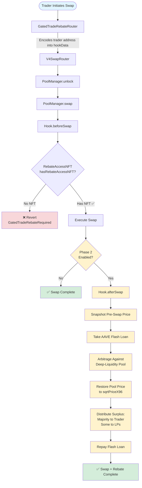

# Gated Trade Rebate Hook

A Uniswap v4 hook that restores the pool price back to its pre-swap value using a post-swap hook, capturing arbitrage opportunities and returning surplus to traders.

**Concept**: You spill money on the floor during the swap (due to price impact) → Your hook picks the money back up → And returns the majority back to you with some left for LPs.

**Only Phase 1 is complete. Phase 2 (The actual rebate from self-arbitraging is WIP)**

## Flow Diagram



## Phase 1: Gated Access Hook ✅ (Complete)

The first phase implements gated access verification to ensure only authorized traders can access the Trade Rebate hook. The hook enforces access requirements by verifying traders own a Rebate Access NFT before executing swaps.

### How It Works

1. Trader calls `GatedTradeRebateRouter.swapExactTokensForTokens()`
2. Router automatically encodes `msg.sender` (trader address) into `hookData`
3. `GatedTradeRebateHook.beforeSwap()` extracts trader address and checks `RebateAccessNFT.hasRebateAccessNFT(trader)`
4. Swap proceeds if NFT exists, otherwise reverts with `GatedTradeRebateRequired`

### Components

- **GatedTradeRebateHook**: Validates NFT ownership before swaps
- **GatedTradeRebateRouter**: Custom router wrapper that auto-encodes trader address into `hookData`
- **RebateAccessNFT**: NFT contract used for gated access verification

### Usage

```solidity
// Deploy hook with RebateAccessNFT contract
GatedTradeRebateHook hook = new GatedTradeRebateHook(poolManager, rebateAccessNFT);

// Users swap through GatedTradeRebateRouter
gatedTradeRebateRouter.swapExactTokensForTokens(
    amountIn,
    amountOutMin,
    zeroForOne,
    poolKey,
    receiver,
    deadline
);
```

See [ARCHITECTURE.md](./ARCHITECTURE.md) for detailed flow diagrams.

---

## Phase 2: Trade Rebate Mechanism 🔄 (WIP)

The core Trade Rebate functionality. Snapshots the price before the swap, performs the swap, then in the post-swap hook, takes out a flash loan from AAVE and performs an arbitrage against a deep-liquidity pool (e.g., main ETH/USDC pool) to return the pool to the original `sqrtPriceX96` without leaving any value-extraction opportunity for arbitraguers. The surplus gained is returned back to the trader with some left for LPs.

### Use Cases

**MEV Protection & Value Capture**: Capture arbitrage opportunities that would otherwise be extracted by external bots, returning value to traders instead of MEV extractors and reducing front-running incentives.

**Price Impact Mitigation**: Restore pool price after large trades, reducing slippage for subsequent traders and maintaining price stability.

**Trader Rebate Programs**: Return arbitrage profits to original traders, sharing surplus between traders and LPs to improve trader economics.

**Institutional Trading**: Enable large trades without leaving arbitrage opportunities on the table, providing better execution for institutions.

**Liquidity Provider Revenue**: Share arbitrage profits with LPs, incentivizing deeper liquidity and improving LP returns.

**Competitive Trading Venues**: Differentiate trading venues with rebates, attracting traders with better economics and creating competitive moats through access control + rebates.
